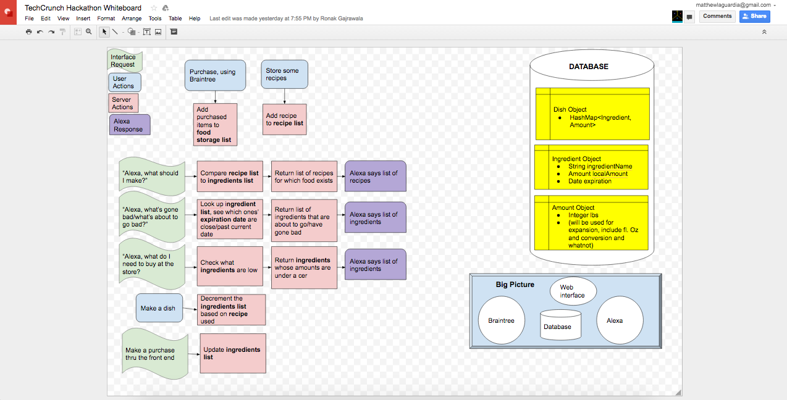
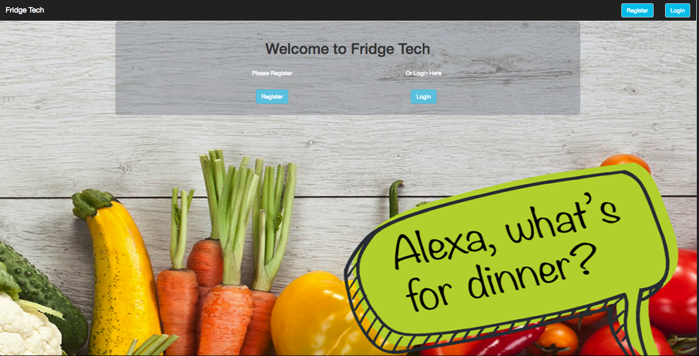

# DisruptHack2016

A demo of our web app can be found at http://myfridge.tech/.

This app's primary use is for amazon's alexa / echo. Our fridge bot (powered by alexa) tracks what food items you have in your fridge and helps make decisions on what you are able to make for dinner. The intent of this app was to try and solve the hardest question of all, what should I make for dinner?

Because, this bot / app was built with alexa, the primary use is for the amazon echo, so you will need to have a connected device in order to use our apps functionality.

Original GitHub with Team Contributors can be found here:
https://github.com/nmauskar/DisruptHack2016

Planning:

Screen Shots:

